# Setting up a Professional Data Science Environment - MacOS Installation

## Introduction

There are two major pieces we need to install in order to set you up for success as a professional data scientist! In this lesson, we will be installing Git and Anaconda for MacOS.

## Objectives

You will be able to:

* Install Git
* Install Anaconda

Please note - the exact names and versions will change over time.

## Installing Git

If you are comfortable with the command line and have installed <a href="https://brew.sh/" target="_blank"> homebrew</a>, you should install Git by running the command `brew install git` in a terminal window. If you have no idea what that last sentence meant, please disregard and follow the below steps.

### Overview

Please also reference the image screengrabs for more detail below.

1. Navigate to Git's download page for MacOS <a href="https://git-scm.com/download/mac" target="_blank">here</a>. Since you are not using homebrew, you should click on the latest version number under the Binary Installer option
    - This should take you to another page, where the download of the installer dmg file should begin automatically after a few seconds
2. Double click on the downloaded dmg file to open a small Finder window
3. Double click on the .pkg file to run it, and click "Open" when the pop-up security warning asks if you are sure you want to open it
    - If you get a security warning that simply says the file cannot be opened because it is from an unidentified developer, then:
        - Click on the Apple symbol at the top left of your screen
        - Select “System Preferences” from the drop-down menu
        - Select “Security and Privacy”
        - Select the “General” tag
        - Below the “Allow apps downloaded from” option, click the "Open Anyway" option. You may need to click the lock to make changes, which will prompt you to enter your password
4. When the Installer opens, click "Continue" on each screen, then "Install"
    - You may need to enter your password when prompted
5. When the installation is complete, click the "Close" button
    - If the installation window asks if you want to move the installer .pkg file to trash, you can click “Move to Trash”

#### Git Installation Step-by-Step:

Step 1: Git’s download page for MacOS - choose the Binary Installer option (click the version number)

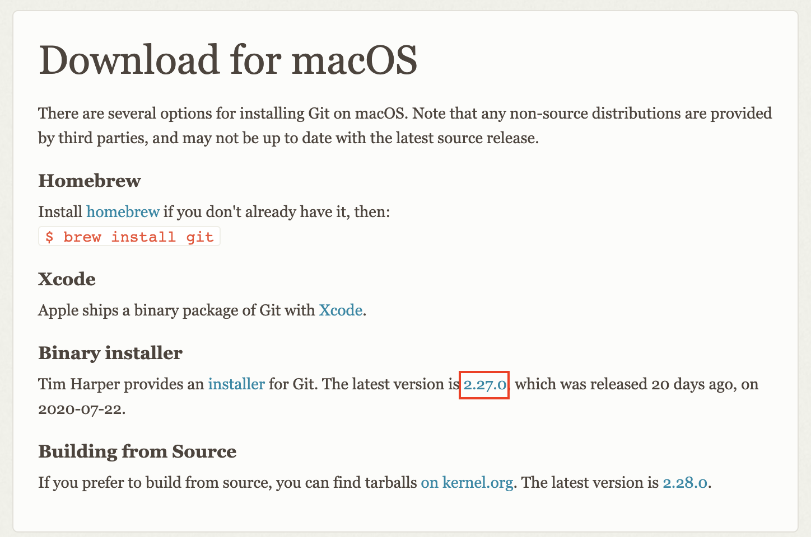

Download the Git .dmg file from the new site (download should begin automatically after a few seconds)

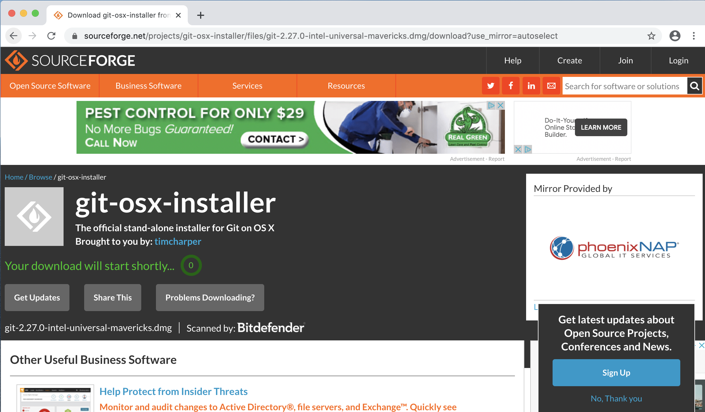

Step 2: Open the downloaded .dmg file

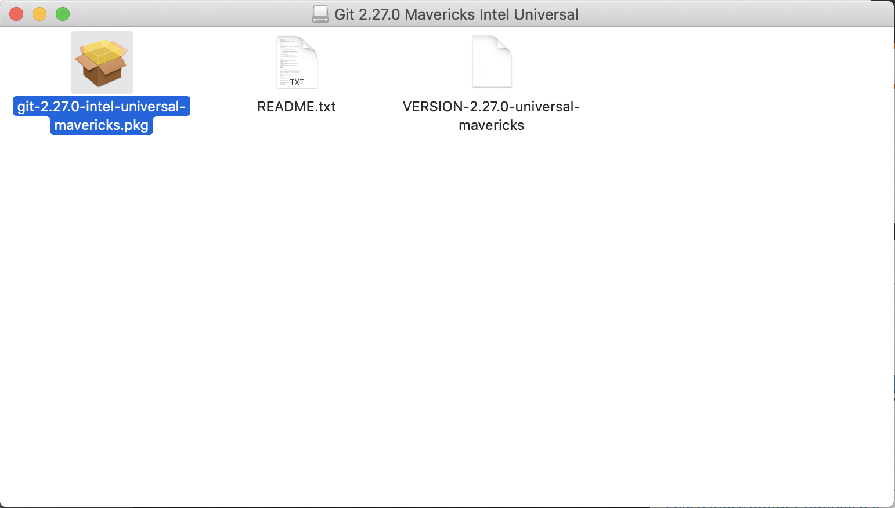

Step 3: Open the downloaded .pkg file inside the .dmg file

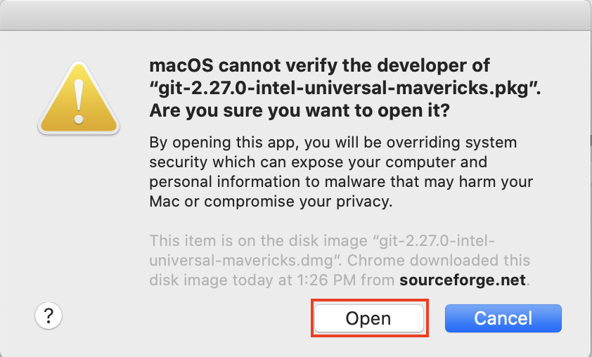

You may need to work around a security warning. If you see this:

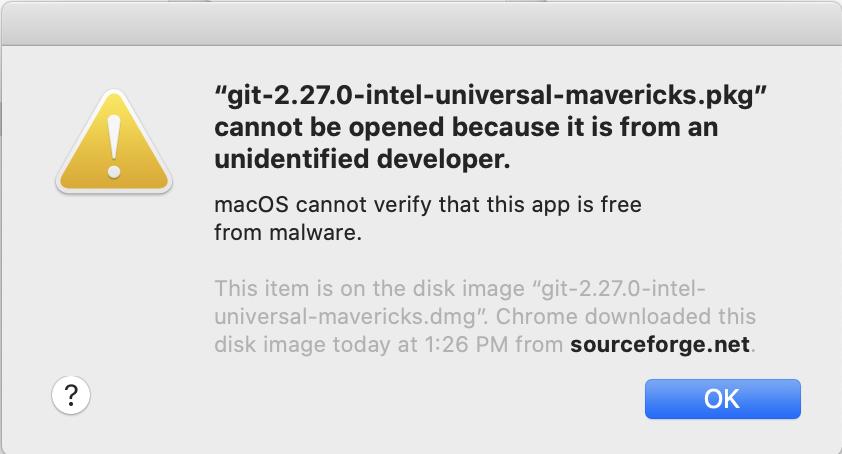

Go to your Security & Privacy menu and click "Open Anyway"

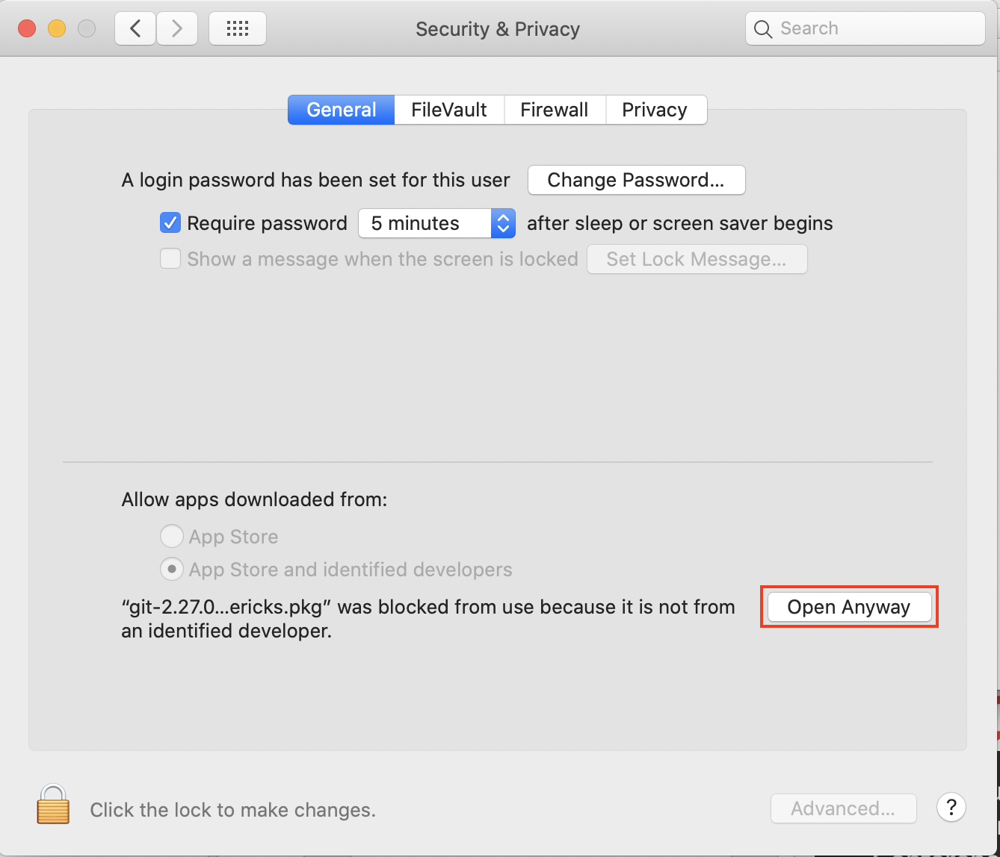

Step 4: Move through the Installer, clicking "Continue" on each screen to stick with the default options, then click "Install"

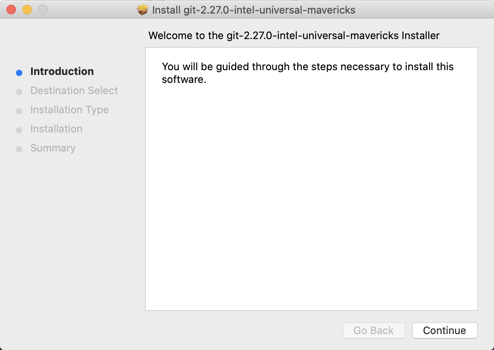

Step 5: Installation Complete! Click “Close”

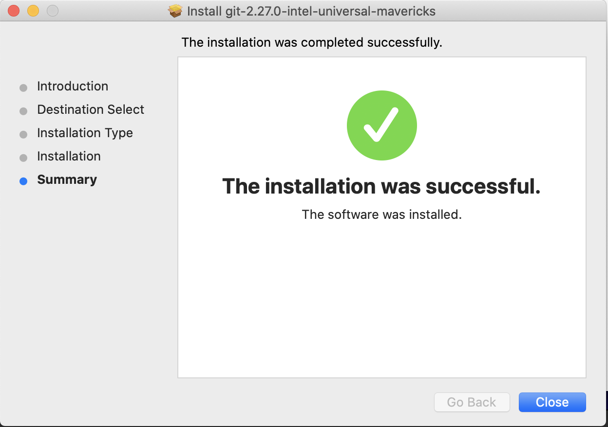

If the installation window asks if you want to move the installer .pkg file to trash, you can click “Move to Trash”

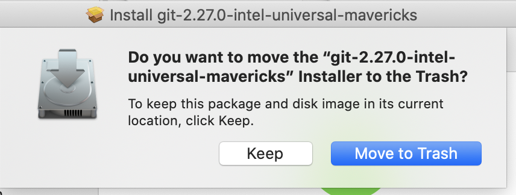

### Confirming Your Git Installation

To confirm you have installed Git successfully:

1. Open a terminal window

    - When we ask you to use the terminal, we mean the “Terminal” app in the “Utilities” folder within your “Applications” folder - or, find the "Terminal" app in your Launchpad (often found in a subdirectory named "Other")

2. Type `git --version`: It should return the version of git you are running

## Installing Anaconda 

The easiest way to get set up with Python and Jupyter Notebook so you can start coding is to install the Anaconda distribution. 

### Overview:

Please also reference the image screengrabs for more detail below.

1. Download the latest version of Anaconda <a href="https://www.anaconda.com/products/individual" target="_blank">here</a>
2. Open the pkg file once it has downloaded to open the Anaconda installer
3. Click "Continue" to run the package to determine if the software can be installed
4. When the Installation window opens, click "Continue"
5. Read the Read Me, then click "Continue"
6. Accept the license by clicking "Continue", then click "Agree" in the pop-up window
7. Click "Install" to install the software
    - You may need to enter your password when prompted
    - You can ignore any supplementary materials advertised, such as PyCharm
8. Click "Close" when the installation was completed successfully
    - If the installation window asks if you want to move the installer .pkg file to trash, you can click “Move to Trash”

#### Anaconda Installation Steps, step-by-step:

Step 1: Download Anaconda, choosing the 64-bit GUI option

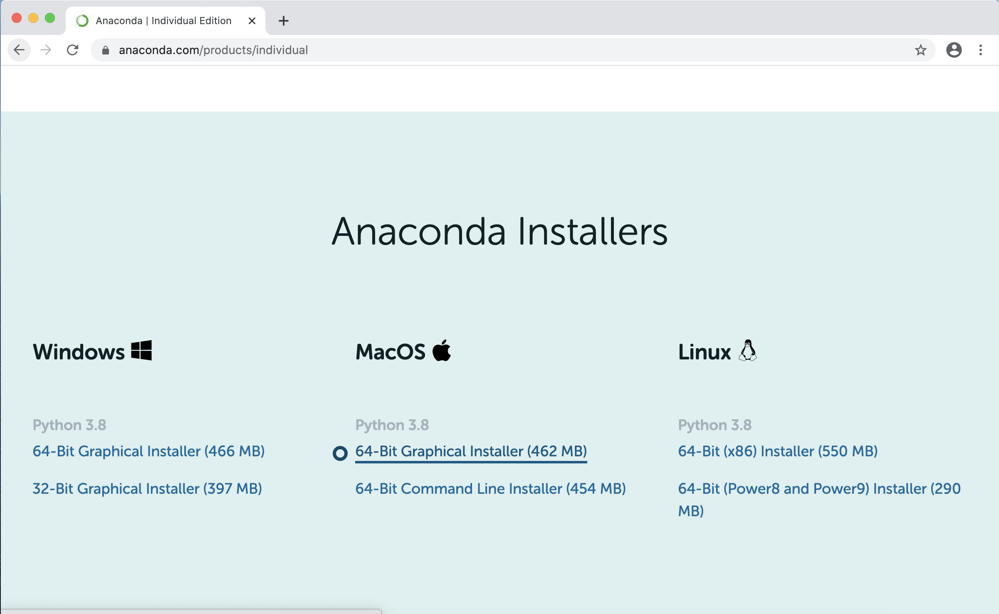

Step 2: Open the downloaded .pkg file

Step 3: Click "Continue" to determine if the package can be installed

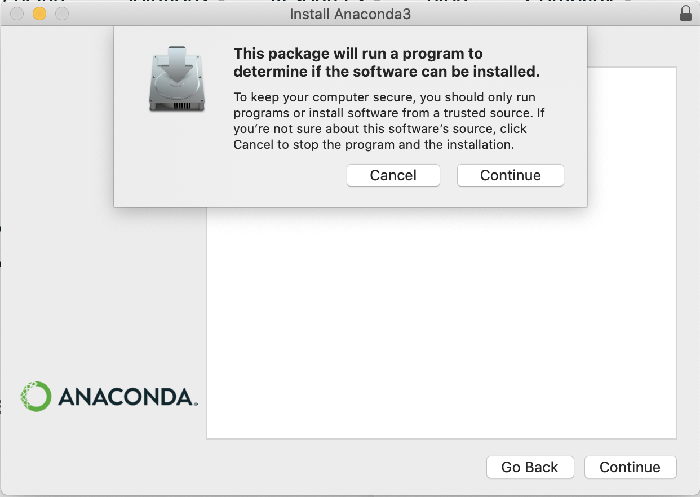

Step 4: Installer - click "Continue"

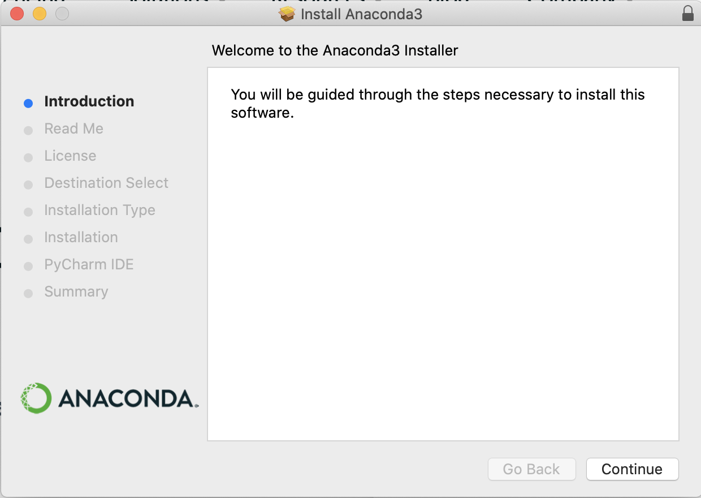

Step 5: Read the Read Me, then click "Continue"

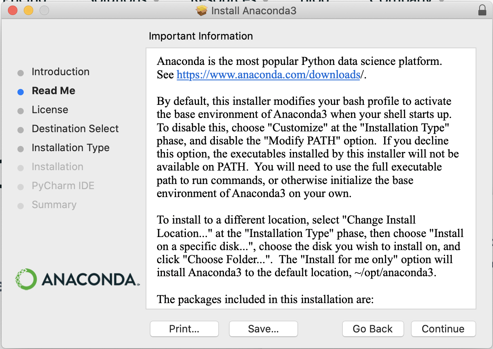

Step 6: Accept the license by clicking "Continue", then click "Agree" in the pop-up window

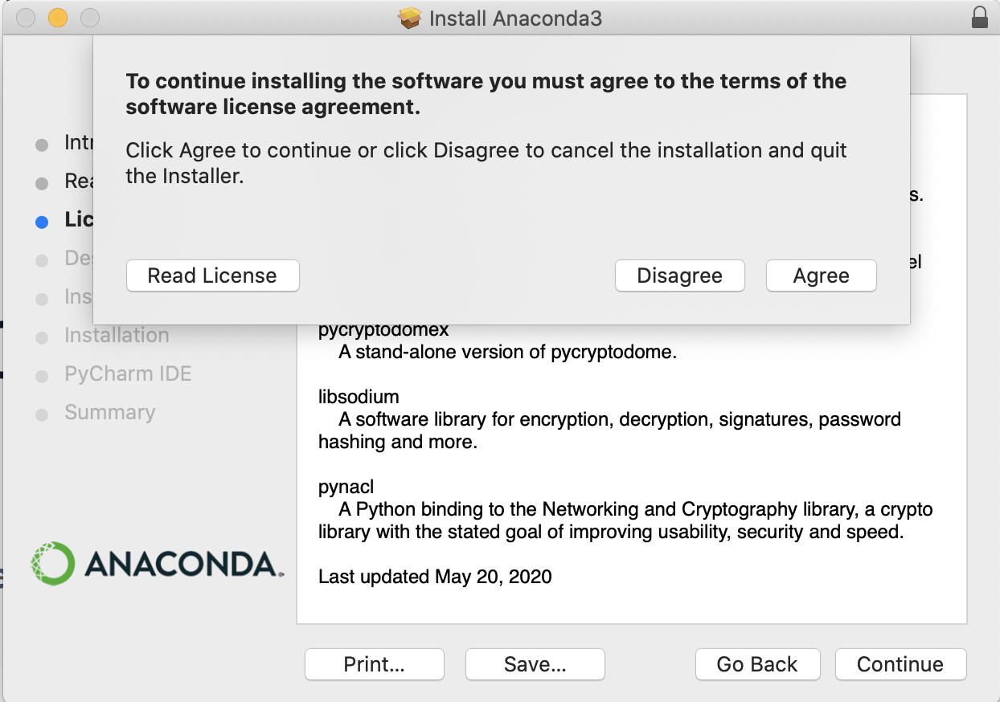

Step 7: Install

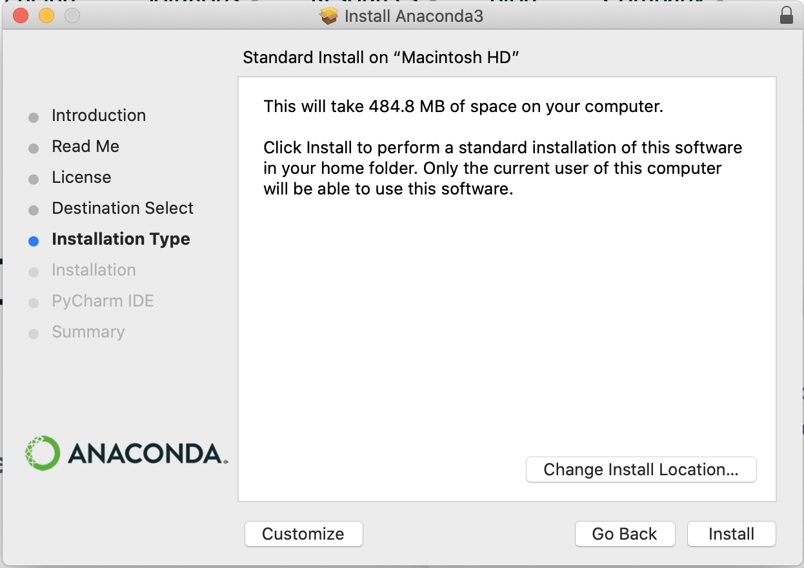

You can ignore any supplementary pages, such as this advertisement for PyCharm

Step 8: Installation Complete! Click "Close"

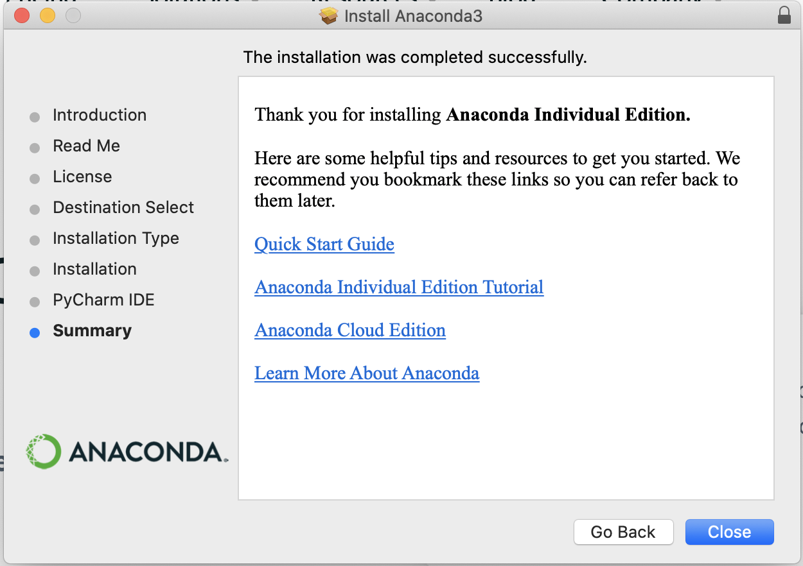

If the installation window asks if you want to move the installer .pkg file to trash, you can click “Move to Trash”

### Confirming Your Anaconda Installation

To confirm you have installed Anaconda successfully:

1. Open a terminal window

2. Type `conda info`: It should return a table of details about your conda installation

## Summary

Congratulations! If you've gotten this far and everything has worked, you have successfully installed Git and Anaconda on your computer! 
